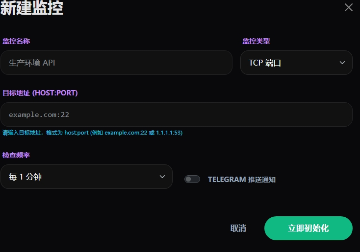
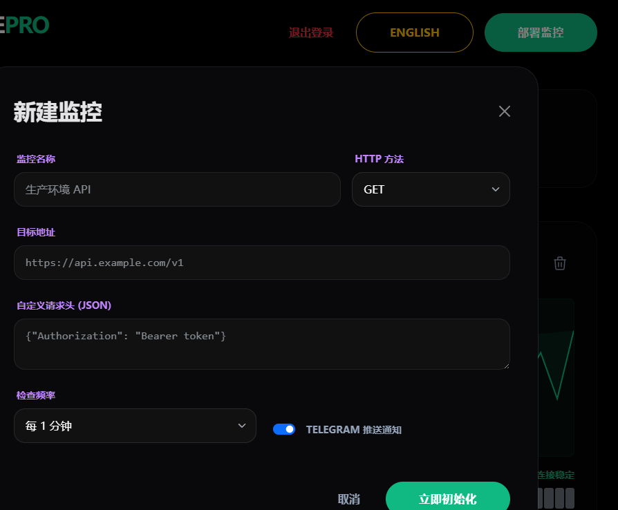
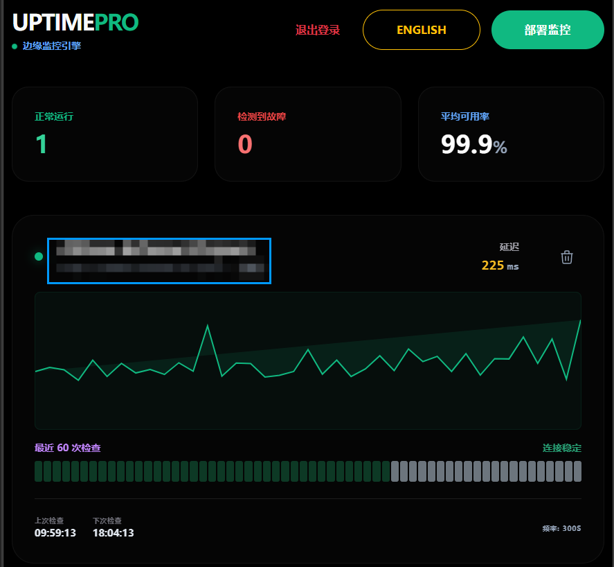
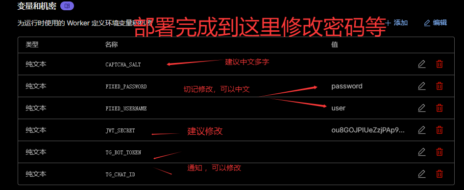
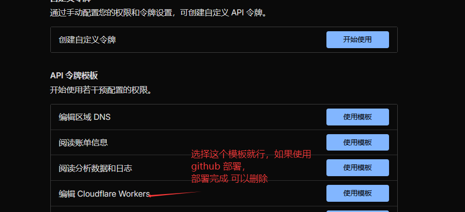
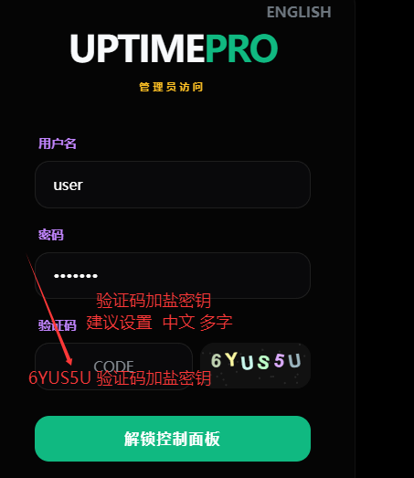

# Uptime Pro 🚀

一个轻量级、自托管的站点监控工具。基于 **Cloudflare Workers**、**Durable Objects** 和 **SQLite** 构建。

## 使用小号部署监控

## 密码等不要在仓库了修改，到 Cloudflare Workers 修改变量密钥。 密码需 大于 12 位

## ✨ 功能特性

- **实时监控**：支持 HTTP(S) TCP 监控，可自定义请求方法、请求头及请求体。
- **SQLite 存储**：利用 Cloudflare Durable Objects 的 SQL API 高效存储监控配置与日志。
- **Telegram 告警**：当站点宕机或恢复时，通过 Telegram 机器人即时推送通知。
- **安全控制面板**：集成 JWT 认证与自定义图形验证码系统。
- **多语言支持**：支持中英文切换。
- **编辑与克隆**：支持对现有监控项进行修改或快速复制。
- **通知测试**：内置测试工具，一键验证 Telegram 配置是否正确。
- **未知**：首次可能提示验证码错误 ，可能触发 CF 的1003 错误，尝试修改默认头。

---
---






## 🛠️ 本地下载与部署教程

### 1. 环境准备
- 确保您的电脑已安装 **Node.js** (建议 v18+) 和 **npm**。
- 拥有一个 **Cloudflare** 账号（Durable Objects ）。

### 2. 下载并安装
1.  下载本项目代码到本地。
2.  在项目根目录打开终端，安装依赖：
    ```bash
    npm install
    ```

### 3. 配置环境变量
打开根目录下的 `wrangler.jsonc` 文件，在 `vars` 部分填入您的配置：
- `TG_BOT_TOKEN`: 您的 Telegram 机器人 Token。
- `TG_CHAT_ID`: 您的 Telegram 用户 ID 或频道 ID。
- `FIXED_USERNAME`: 管理员登录用户名（默认 `admin`）。
- `FIXED_PASSWORD`: 管理员登录密码（默认 `password`）。
- `JWT_SECRET`: 随机字符串，用于 JWT 签名。
- `CAPTCHA_SALT`: 随机字符串，用于验证码加盐。

### 4. 部署到 Cloudflare
在终端运行以下命令：
```bash
npm run deploy
```
首次运行会提示您登录 Cloudflare 账号，按照提示完成授权即可。

---

## 🤖 GitHub Actions 自动部署教程

通过 GitHub Actions，您可以在每次推送代码到 `main` 分支时自动完成部署。

### 1. 获取 Cloudflare API Token
1.  登录 [Cloudflare 控制台](https://dash.cloudflare.com/)。
2.  点击右上角 **我的个人资料** > **API 令牌** > **创建令牌**。
3.  使用 **编辑 Cloudflare Workers** 模板，选择您的账户和资源，完成创建并复制生成的令牌。

### 2. 在 GitHub 设置 Secret
1.  打开您的 GitHub 仓库页面。
2.  点击 **Settings** > **Secrets and variables** > **Actions**。
3.  点击 **New repository secret**。
4.  Name 填入：`CLOUDFLARE_API_TOKEN`。
5.  Value 填入您刚才在 Cloudflare 创建的 API 令牌。

### 3. 触发部署
actions 需要手动触发，可以向 AI 请教

---

## ⚙️ 配置文件说明 (`wrangler.jsonc`)

| 变量名 | 说明 | 默认值 |
| :--- | :--- | :--- |
| `TG_BOT_TOKEN` | Telegram 机器人 API Token | - |
| `TG_CHAT_ID` | 接收通知的 Chat ID | - |
| `FIXED_USERNAME` | 管理后台用户名 | `admin` |
| `FIXED_PASSWORD` | 管理后台密码 | `password` |
| `JWT_SECRET` | JWT 签名密钥 | (建议修改) |
| `CAPTCHA_SALT` | 验证码加盐密钥 | (建议修改) |

## 📜 许可证

本项目采用 MIT 许可证。您可以自由使用、修改和分发。
